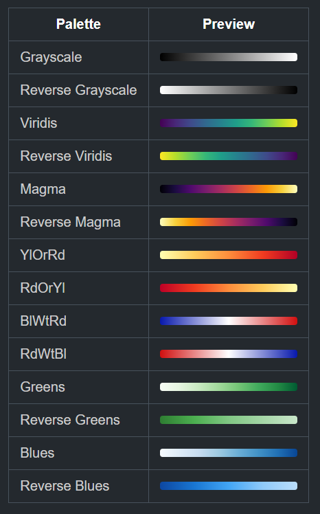

# MaPage

**MaPage** (Map Page) is a minimal GitHub Page designed to read and visualize GeoJSON and GeoTIFF files directly in your browser; it is a fully client-side map viewer powered by Leaflet.

It was built with one goal in mind: to let anyone open and explore geospatial data without installing software, creating accounts, or uploading files to third-party platforms.

##### Features
- Load and visualize your own GeoJSON (vector) and GeoTIFF (raster) files
- User-friendly interface:
  - Click features to view their attributes in popups
  - Rename and toggle layers with a right-click
  - Zoom to a layer’s extent with a double-click
  - Choose your own color palette for rasters or import your style for vector layers
- No registration or authentication
- No ads

 ...just a simple static GitHub Page.

> ## [🚀 Go to MaPage](https://gujooo.github.io/MaPage/)

---

## Tutorial

---
## Import Your Style
### GeoJSON

You can customize the style of each feature in your GeoJSON file by adding specific properties to the `properties` object.

> **Note:**
> - If a feature has no styling properties, the default values above are applied automatically.
> - The field names are **case-sensitive**; different field names will be treated as feature details and showed in popups.

#### Point / MultiPoint

| Property    | Type     | Description                         | Default  |
|------------|---------|-------------------------------------|---------|
| radius     | number  | Circle marker radius                | 6       |
| color      | string  | Stroke color                        |  |
| fillColor  | string  | Fill color                          |  |
| weight     | number  | Stroke width                        | 2       |
| opacity    | number  | Stroke opacity (0–1)               | 1       |
| fillOpacity| number  | Fill opacity (0–1)                 | 0.8     |

#### LineString / MultiLineString

| Property | Type    | Description            | Default   |
|----------|--------|------------------------|-----------|
| color    | string | Line color             |  |
| weight   | number | Line width             | 3         |
| opacity  | number | Line opacity (0–1)     | 0.9       |

#### Polygon / MultiPolygon

| Property   | Type    | Description           | Default   |
|------------|--------|----------------------|-----------|
| color      | string | Stroke color          |  |
| weight     | number | Stroke width          | 2         |
| opacity    | number | Stroke opacity (0–1) | 0.8       |
| fillColor  | string | Fill color            |  |
| fillOpacity| number | Fill opacity (0–1)    | 0.3       |

#### Default (all other geometry types)

| Property   | Type    | Description           | Default   |
|------------|--------|----------------------|-----------|
| color      | string | Stroke color          |  |
| weight     | number | Stroke width          | 2         |
| opacity    | number | Stroke opacity (0–1) | 0.8       |
| fillColor  | string | Fill color            |  |
| fillOpacity| number | Fill opacity (0–1)    | 0.2       |


An example of GeoJSON:
```json
{
  "type": "FeatureCollection",
  "features": [
    {
      "type": "Feature",
      "properties": {
        "Name": "Sample Point - Belluno",
        "Description": "Random <b style='color:red;'>Sample Point</b> over the city of Belluno Italy",
        "radius": 8,
        "color": "#ff0000",
        "opacity": 0.3,
        "fillOpacity": 1
      },
      "geometry": {
        "type": "Point",
        "coordinates": [12.21965981437214, 46.13839927599409]
      }
    },
    {
      "type": "Feature",
      "properties": {
        "Name": "Sample Line - Belluno",
        "color": "#00aa00",
        "weight": 4,
        "opacity": 0.8
      },
      "geometry": {
        "type": "LineString",
        "coordinates": [
          [12.217615781551348, 46.13601868071367], 
          [12.221664565028005, 46.13748580940446],
          [12.222648902295266, 46.136134508084105]
        ]
      }
    },
    {
      "type": "Feature",
      "properties": {
        "Name": "Sample Polygon - Belluno",
        "Description":"Rectangular polygon over the city of Belluno Italy",
        "color": "#0000ff",
        "fillColor": "#ccccff",
        "weight": 2,
        "opacity": 0.9,
        "fillOpacity": 0.5
      },
      "geometry": {
        "type": "Polygon",
        "coordinates": [
          [
            [12.215, 46.137],
            [12.219, 46.137],
            [12.219, 46.139],
            [12.215, 46.139],
            [12.215, 46.137]
          ]
        ]
      }
    }
  ]
}
```

### GeoTIFF
GeoTIFF files uploaded to **MaPage** are handled differently depending on their band structure:
 - RGB (three-band raster)
 - PCT / Single-band raster

##### Single-band GeoTIFF (PCT)
By default, single-band GeoTIFF files are rendered using a grayscale stretch.
The color palette can be changed at any time by clicking the color bar in the layer legend selecting one of the available color maps.

##### RGB GeoTIFF (three-band)

By default, RGB GeoTIFF files preserve their original embedded colors. However, users can optionally convert the RGB raster into a pseudo-color single-band visualization by selecting a color palette from the legend (via the “`to PCT`” control).

It is always possible to revert back to the default rendering using the “`canc`” option in the palette menu.

#### Available Color Palettes
The following color palettes are available for single-band rendering and RGB-to-PCT conversion:



---

## Credits

MaPage is built using the following open-source libraries and data sources:

- **[Leaflet](https://leafletjs.com/)** – Interactive maps library  
- **[OpenStreetMap](https://www.openstreetmap.org/)** – Base map data  
- **[Georaster](https://github.com/GeoTIFF/georaster)** – Client-side GeoTIFF parsing  
- **[Georaster-layer-for-leaflet](https://github.com/GeoTIFF/georaster-layer-for-leaflet)** – GeoTIFF rendering in Leaflet  
- **[GeoTIFF.js](https://github.com/geotiffjs/geotiff.js)** – GeoTIFF decoding library  


